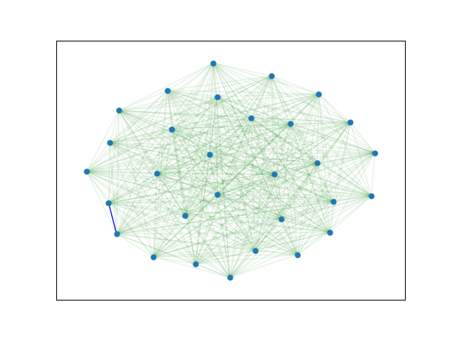

# Graph algorithms and decision trees

The code for the discrete mathematics lab.

Authored by [pmozil](https://github.com/pmozil) and [cyberprince2201](https://github.com/cyberprince2201)

The lab consists of five algorithms, four of them related to graphs, while the last one is a decision tree fitter.

These are:
- Prim's algorithm
- Kruskal's algorithm
- Floyd-Warshall algorithm
- Bellman-Ford's algorithm
- The decision tree

To view the full report, go to colaboratory, link for which is in the badge above.
Also, enjoy the gifs of the minimal spanning tree algorithms

## Kruskal's algorithm

## Prim's algorithm
